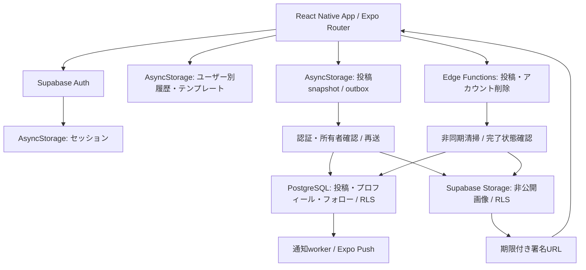

# LOADS

**No flex, just work.**

筋トレ後にワークアウト内容と写真を共有する、トレーニング特化SNS。記録を続けやすくし、仲間の実際のトレーニングにつながる体験を目指す個人開発プロジェクトです。

## 開発背景

筋トレ仲間との「既存の筋トレアプリは、実際にトレーニングする人が欲しいものとズレている」という会話をきっかけに、自分たちが使いたいものを作ろうと考えて開発しました。前回の記録を確認しながらトレーニングし、終了後に内容を共有する流れを中心に設計しています。

企画・設計・実装・テストからEAS BuildによるiOSビルド、TestFlightへのアップロードと外部テスト審査提出まで個人で担当しています。

**配布状況：** iOS 1.0.0 build 7をTestFlightへアップロードし、2026-10-05にBeta App Reviewへ提出。「審査待ち」を確認済みです。承認・パブリックリンク発行は未確認で、App Store一般公開はしていません。

## Features

| 領域 | 実装済み機能 |
| --- | --- |
| Workout | 種目選択・カスタム種目、種目順変更、セットごとの重量・回数・メモ・完了状態、種目メモ、前回の同じfocusの記録参照・コピー |
| Progress | 重量・回数・ボリュームのPR判定、履歴・詳細、プロフィール集計、ワークアウトのテキストコピー |
| Templates | 種目とfocusの保存・再利用・削除。重量・回数はテンプレートに引き継がない |
| Cardio | ランニング・ウォーキング等の時間と種目別の任意項目（距離・速度・傾斜等）、筋トレとの混在記録・履歴・投稿表示 |
| Social | ワークアウト投稿、任意の写真・キャプション、本人とフォロー先のFeed、完全一致のユーザー名検索、フォロー・解除、プロフィール、トレーニング仲間のタグ |
| Auth | メール・パスワード登録／ログイン、メール確認コールバック、セッション永続化、ログアウト、ユーザーごとの端末データ分離 |
| Reliability | 投稿outbox、失敗時の再送、client IDによる重複防止、本人投稿の削除・画像の非同期清掃 |
| Account | パスワード再確認を伴うアカウント削除、receiptによる状態確認、サーバー完了後の端末データ清掃 |
| Notifications | 通知設定、端末登録、フォロー先のワークアウト完了／仲間タグ通知、送信worker・receipt確認の実装 |

ワークアウト履歴・テンプレートは**端末内**保存で、クラウド投稿とは別のデータです。履歴の端末間同期はありません。プッシュ通知は実機・権限・サーバー設定が必要で、実装の存在と実機配信検証は区別しています。

## Screenshots

公開用の実機スクリーンショットは準備中です。Starter画像やアイコンを画面の代わりには掲載していません。

| Workout | Feed | Profile | Post |
| --- | --- | --- | --- |
| 準備中 | 準備中 | 準備中 | 準備中 |

## Tech Stack

| 分類 | 技術 |
| --- | --- |
| Frontend | React Native 0.86、React 19、Expo SDK 57、Expo Router、TypeScript |
| Backend / Infrastructure | Supabase、PostgreSQL、Supabase Auth、Supabase Storage、Row Level Security、Edge Functions、Cron |
| Local persistence | AsyncStorage（ユーザー別の記録・テンプレート・投稿outbox・認証セッション） |
| Media / Notifications | Expo Image Picker、Image Manipulator、File System、Expo Notifications |
| Distribution | EAS Build / Submit、TestFlight |
| Testing / Quality | TypeScript strict mode、ESLint / Expo lint、Node.js test runner、PGliteによるPostgreSQLテスト |

正確な依存バージョンは[package.json](package.json)と[package-lock.json](package-lock.json)を参照してください。

## Architecture



端末記録を中心に、投稿時にsnapshotをクラウドへ送ります。認証セッションからユーザーを確認し、DB・Storage側でRLSを適用します。画像は非公開bucketに保存し署名URLで表示。再送は同じclient IDを保持し、DBの一意制約で二重投稿を防ぎます。

```text
src/app/            Expo Routerの画面・レイアウト
src/components/     ワークアウト・投稿・認証状態のUI
src/hooks/          所有者・プロフィール・Feed等の状態管理
src/lib/            端末保存、投稿、写真、Auth、削除、通知
src/types/          Supabaseのデータ型
supabase/migrations/ テーブル・RLS・RPCのSQL
supabase/functions/  削除・清掃・通知のEdge Functions
supabase/ops/        運用確認・Cron設定SQL
tests/               Node.js / PGliteのテスト
scripts/             環境検査・デプロイ準備
docs/                設計・検証記録
```

## Engineering Challenges / Design Decisions

### 1. 通信失敗と二重投稿

**課題：** アップロードや投稿作成の応答喪失で記録消失・重複が起きる。**設計：** 投稿前にユーザー別outboxへsnapshotを保存し、pending / failed / published / deletedを管理。同じclient ID・画像パスで再送し、DBの`(user_id, client_post_id)`一意制約と既存行確認を組み合わせる。**解決：** 失敗時もデータを保持し、再試行を既存投稿へ収束させる。[cloudPosts.ts](src/lib/cloudPosts.ts) / [postOutbox.ts](src/lib/postOutbox.ts)

### 2. アカウント切替時の記録混在

**課題：** 共通の端末キーでは別アカウントの記録が混ざる。**設計：** UUID別のキー、書込みの直列化、ログアウト前のflush、処理中の所有者確認を使う。旧データは明示的に移行。**解決：** 他ユーザーの記録を保持したまま所有者を一致させる。[userLocalData.ts](src/lib/userLocalData.ts) / [accountSession.ts](src/lib/accountSession.ts)

### 3. 写真と投稿のアクセス制御

**課題：** UIだけの制限ではAPIへの直接アクセスを防げない。**設計：** 投稿の所有者・フォロー関係をRLSで検査し、Feed viewはsecurity invoker。Storageは非公開bucketとアクセスpolicy・署名URLを使う。**解決：** DB・Storage側で表示可能なデータを制御する。[migrations](supabase/migrations) / [postPhotos.ts](src/lib/postPhotos.ts)

### 4. 削除処理の途中失敗

**課題：** Auth・DB・Storage・端末を一度に削除できない。**設計：** 投稿tombstone、画像清掃job、アカウント削除receipt、非同期workerを使い、残存データを確認して完了にする。端末清掃は対象UUIDに限定。**解決：** 再試行・状態回復を可能にし、未確認の応答を完了扱いしない。[accountDeletion.ts](src/lib/accountDeletion.ts) / [Functions](supabase/functions)

### 5. 通知失敗と記録保存の分離

**課題：** 通知や通信の失敗がワークアウト保存を妨げる。**設計：** 完了記録の同期状態を端末に保持し、workerが通知を処理。過去履歴を突然送信しないbaseline、重複排除、本人除外、設定による抑制を持つ。**解決：** 記録を保持しながら同期を再試行できる。[notifications.ts](src/lib/notifications.ts) / [push-worker](supabase/functions/push-worker)

## Testing

2026-10-06のローカル実行：**34テストファイル、129テスト成功、失敗・スキップ0**。その時点の実行件数であり、本番検証件数ではありません。

| 対象 | 検証内容 |
| --- | --- |
| 投稿・写真 | 通信／応答喪失、再送、重複排除、所有者変更、写真清掃 |
| Auth・端末保存 | コールバック、セッション、ユーザー別隔離、旧データ移行、logoutと保存順序 |
| DB・削除 | PGlite上のRLS・RPC・制約、receipt、状態遷移、完了条件、再試行 |
| Social・通知 | フォロー／Feed、プロフィール、タグ、設定・重複抑制、完了同期 |
| Workout | Strength / Cardioの入力・集計・表示、コピー、終了確認 |

依存をモックしたロジック検査やソース構造の回帰検査も含みます。PGliteは本番Supabaseと同一環境ではなく、実機E2E・APNs・カメラの検証を代替しません。

```bash
npm run typecheck
npm run lint
npm test
# Edge Functionsはアプリのtsconfig対象外なので別途検査
npx tsc -p supabase/functions/tsconfig.json
```

実装・テスト・Supabase・設定をGit管理対象に揃えています。機能とファイルの対応、匿名化・除外対象は[Publication Manifest](docs/publication-manifest.md)を参照してください。各機能の変更履歴はGitのコミットログから確認できます。

## Getting Started

Expo SDK 57に対応するNode.js環境とnpm、自身のSupabaseプロジェクトを用意します。

```bash
npm ci
# .env.exampleを.envへコピーし、自身のプロジェクト値を設定
npm start
# ブラウザーでUI確認
npm run web
```

`EXPO_PUBLIC_SUPABASE_URL`とpublishable / anon keyを設定します。公開キーは秘密鍵ではありませんが、データ保護にはRLSが必要です。service_role・secret keyをクライアントに入れません。

Auth・プロフィール初期構成と、追加SQL・Functions・Storage・Cronの設定が必要です。空のSupabaseへの一括bootstrapは未検証です。既存環境へmigrationを無条件に再適用しないでください。アカウント削除は対応するサーバー設定確認後にUIを有効化します。写真・通知の実機確認にはdevelopment buildまたはTestFlightを使います。EASのproduction環境変数は端末の`.env`と別に設定し、鍵・審査用ログイン情報はコミットしません。

## Architecture Notes / Next Steps

- `workout.tsx`は5,327行・113,101 bytes（2026-10-06時点）。セッション、記録比較・PR、種目／セット編集、テンプレート、UIを担います。今回は分割せず、将来の境界を[Architecture Notes](docs/architecture-notes.md)に整理しました。
- 公開用実機スクリーンショット、実機検証記録、CI、空の環境でのbootstrapは今後の改善対象です。
- Starter残存・Git管理・秘密情報検査の範囲は[Portfolio Readiness](docs/portfolio-readiness.md)を参照してください。
